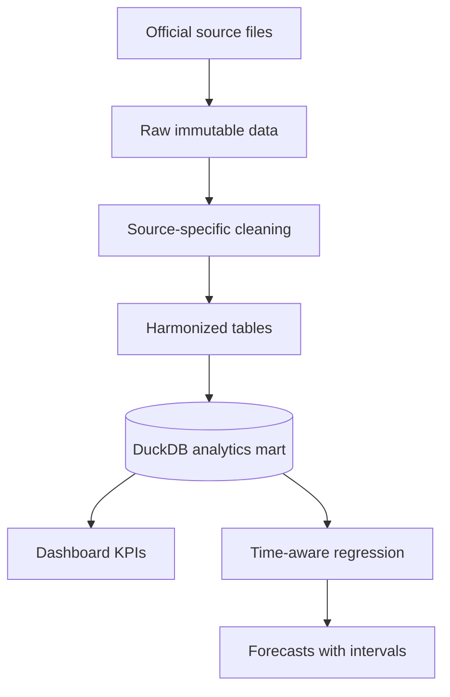

# Canadian Surgical Wait Times Analytics

An approachable two-week data analytics project for comparing surgical wait-time performance across Canada's 10 provinces, tracking a small set of KPIs, storing clean data in DuckDB, and producing a simple regression-based forecast.

> Status: two-week MVP scaffold. The repository contains a verified source catalogue, simple harmonized schema, starter DuckDB pipeline, 10-working-day roadmap, and room for future expansion. Raw source files are intentionally not committed.

## Two-week MVP

The first release intentionally stays small:

- One primary dataset: CIHI pan-Canadian priority-procedure tables
- Three procedures: hip replacement, knee replacement and cataract surgery
- Five KPIs: median wait, P90 wait, within-benchmark rate, completed volume and year-over-year change
- One province-level DuckDB fact table
- One two-page Power BI or Tableau dashboard
- One simple linear-regression trend model, compared with a naive forecast

Provincial hospital-level datasets, automated downloads, population/workforce features, interactive apps and advanced forecasting belong in the future backlog—not the first two weeks.

## What this project will answer

- Which provinces have the shortest median and 90th-percentile waits for comparable procedures?
- What percentage of patients receive care within the pan-Canadian benchmark?
- How have wait times, completed volumes, and waiting-list volumes changed over time?
- Which procedures and provinces show the largest gaps or fastest improvement?
- What might wait times look like over the next 2–3 years, with uncertainty clearly shown?

## Recommended scope

Start with three procedures that have stable national definitions and coverage:

1. Hip replacement — benchmark: 182 days (26 weeks)
2. Knee replacement — benchmark: 182 days (26 weeks)
3. Cataract surgery — benchmark: 112 days (16 weeks)

Add hip-fracture repair, cancer surgery, CABG, radiation therapy, CT and MRI only after the first dashboard is correct. CIHI is the MVP comparison layer. Provincial datasets are documented for later drill-downs.

## Data strategy

| Layer | Purpose | Rule |
| --- | --- | --- |
| CIHI pan-Canadian | Fair province-to-province comparison | Use as the authoritative comparison layer |
| Provincial sources | Hospital, surgeon, specialty, monthly or quarterly detail | Do not mix with CIHI until definitions and periods are mapped |
| Context data | Population, age structure, workforce, beds and spending | Use as explanatory features, not as wait-time replacements |

The latest CIHI 2008–2025 table currently describes hip and knee replacement data. Keep the broader 2008–2024 priority-procedure table for cataract and other procedures until CIHI publishes a newer comparable release for them. See [docs/data_sources.md](docs/data_sources.md).

## Architecture



## Repository structure

```text
.
├── config/                  # Source catalogue and mappings
├── data/
│   ├── raw/                 # Unchanged downloads; ignored by Git
│   ├── interim/             # Source-specific cleaned files; ignored
│   ├── processed/           # Harmonized analytical data; ignored
│   ├── external/            # Population/workforce/context files; ignored
│   └── sample/              # Small synthetic example committed for tests
├── dashboards/              # Power BI, Tableau, or Streamlit work
├── docs/                    # Sources, metrics, roadmap, dictionary, workflow
├── models/                  # Serialized models and reports; ignored
├── notebooks/               # Numbered exploration notebooks
├── reports/figures/         # Exported charts
├── scripts/                 # Reproducible command-line entry points
├── sql/                     # DuckDB schema and analytical views
├── src/wait_times/          # Reusable Python package
└── tests/                   # Automated quality checks
```

## Quick start

Prerequisites: Python 3.11+ and Git.

```bash
python -m venv .venv
```

Activate it on Windows PowerShell:

```powershell
.venv\Scripts\Activate.ps1
```

Install dependencies and build a demo database:

```bash
python -m pip install -e ".[dev]"
python scripts/build_database.py --use-sample
python scripts/run_quality_checks.py --use-sample
```

The demo command creates `data/analytics.duckdb` from clearly labelled synthetic records. It proves the pipeline works; it is not real health-system evidence.

## How to add real data

1. Open [config/sources.csv](config/sources.csv) and choose a source.
2. Download the source to `data/raw/<source_id>/` without editing the original.
3. Record the retrieval date and source version in `data/raw/<source_id>/README.md`.
4. Create or update a source-specific loader under `src/wait_times/ingest/`.
5. Output data matching [docs/data_dictionary.md](docs/data_dictionary.md) to `data/processed/wait_times_harmonized.csv`.
6. Run:

```bash
python scripts/build_database.py
python scripts/run_quality_checks.py
```

## Core KPIs

| KPI | Meaning | Preferred direction |
| --- | --- | --- |
| Median wait | Days by which 50% of completed patients received surgery | Lower |
| 90th-percentile wait | Days by which 90% of completed patients received surgery | Lower |
| Within-benchmark rate | Percent completed within the agreed benchmark | Higher |
| Completed volume | Procedures completed in the reporting period | Context-dependent |
| Waiting-list volume | Patients waiting at the reporting date | Lower, with demand context |
| Backlog rate | Waiting list per 100,000 residents | Lower |
| YoY change | Current KPI versus previous comparable period | Depends on KPI |

Definitions and formulas are in [docs/kpi_definitions.md](docs/kpi_definitions.md).

## MVP forecasting approach

Keep the first model transparent:

- Target: median wait in days, separately by procedure and province.
- Baseline: use the last observed value as the next forecast.
- Regression: fit a straight-line trend using year as the predictor.
- Validation: train on earlier years and test on the latest 2–3 years; never randomly shuffle years.
- Output: next 2 years with a visible “exploratory forecast” label.
- Guardrail: explain that the model shows a trend, not a causal prediction or promise.

See [docs/modelling_plan.md](docs/modelling_plan.md).

## Dashboard plan

Build two pages:

1. **Province comparison:** KPI cards, procedure filter, province bar chart and within-benchmark comparison.
2. **Trends and forecast:** historical median/P90 trend, completed volume, simple two-year forecast and methodology note.

Never rank a province when its value is missing, suppressed, based on a different wait segment, or marked `comparability_tier = C`.

## Two-week team plan

The complete 10-working-day plan and role assignments are in [docs/roadmap.md](docs/roadmap.md). The short version is:

- Days 1–2: confirm scope, download CIHI data and understand definitions
- Days 3–4: clean and load the three procedures into DuckDB
- Days 5–6: calculate KPIs and complete exploratory analysis
- Days 7–8: build the dashboard and simple regression forecast
- Days 9–10: validate, document, rehearse and present

Expansion ideas are deliberately separated into [docs/future_backlog.md](docs/future_backlog.md).

## Data ethics and limitations

- These are aggregate operational data, not individual medical advice.
- Published waits usually describe completed cases; they may not equal the current wait of someone still on a list.
- Provinces may differ in exclusions, urgency levels, first-eye/second-eye cataracts, patient-unavailable days and reporting periods.
- Suppressed small counts must remain suppressed.
- COVID-19 created a structural break. Report pre-pandemic, pandemic and recovery periods explicitly.
- Forecasts are scenarios with uncertainty, not promises about future access.

## Contributing

Use a feature branch and a pull request. Do not commit raw health data, credentials, `.duckdb` files, model binaries, or dashboard extracts. See [CONTRIBUTING.md](CONTRIBUTING.md) and [docs/team_workflow.md](docs/team_workflow.md).

## License

Repository code and original documentation are released under the MIT License. Source datasets retain their publishers' licences and attribution requirements.

## Source verification

The source catalogue was reviewed on **2026-08-27**. Re-check URLs, licences, coverage and definitions before each refresh.
