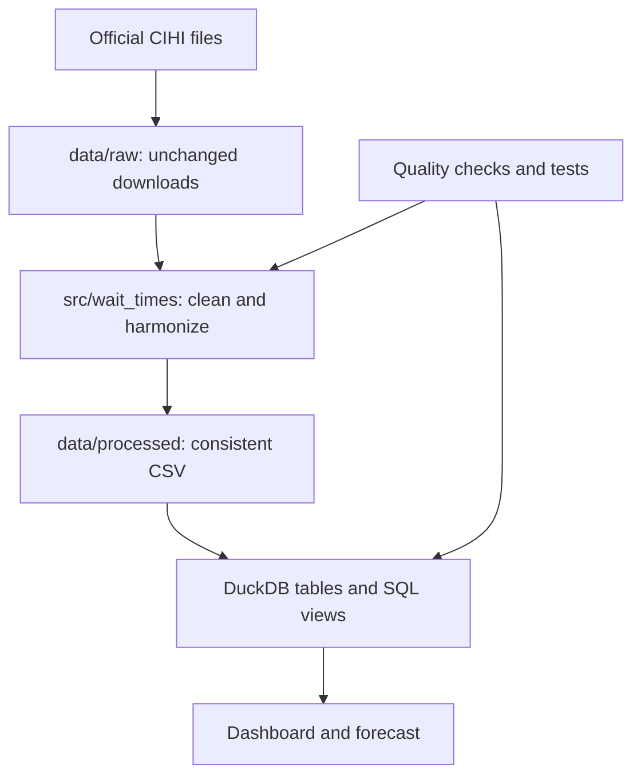

# Repository guide: what every file does

This guide explains the repository in beginner-friendly language. Use it to understand where data belongs, which files run the pipeline, and which teammate is likely to work in each area.

## 1. The project in one sentence

The repository turns official Canadian surgical wait-time files into one consistent dataset, checks it, loads it into DuckDB, and makes the resulting KPIs available to a dashboard and a simple forecast.

## 2. How the pieces fit together



The main hand-off file is `data/processed/wait_times_harmonized.csv`. It follows the columns defined in `docs/data_dictionary.md`. Both the dashboard and the forecast should use this consistent data instead of keeping separate spreadsheet copies.

## 3. Complete repository tree

```text
canadian-surgical-wait-times-analytics/
├── .github/
│   └── workflows/
│       └── quality.yml
├── config/
│   ├── procedure_crosswalk.csv
│   └── sources.csv
├── dashboards/
│   ├── powerbi/
│   │   └── README.md
│   ├── streamlit/
│   │   └── README.md
│   ├── tableau/
│   │   └── README.md
│   └── README.md
├── data/
│   ├── external/
│   │   └── .gitkeep
│   ├── interim/
│   │   └── .gitkeep
│   ├── processed/
│   │   └── .gitkeep
│   ├── raw/
│   │   └── .gitkeep
│   └── sample/
│       ├── README.md
│       └── wait_times_example.csv
├── docs/
│   ├── data_dictionary.md
│   ├── data_sources.md
│   ├── decision_log.md
│   ├── future_backlog.md
│   ├── kpi_definitions.md
│   ├── methodology.md
│   ├── modelling_plan.md
│   ├── repository_guide.md
│   ├── roadmap.md
│   └── team_workflow.md
├── models/
│   └── .gitkeep
├── notebooks/
│   └── README.md
├── reports/
│   └── figures/
│       └── .gitkeep
├── scripts/
│   ├── build_database.py
│   ├── run_quality_checks.py
│   └── train_baseline.py
├── sql/
│   ├── schema.sql
│   └── views.sql
├── src/
│   └── wait_times/
│       ├── ingest/
│       │   └── README.md
│       ├── models/
│       │   ├── README.md
│       │   └── linear_trend.py
│       ├── transform/
│       │   └── README.md
│       ├── __init__.py
│       ├── db.py
│       └── quality.py
├── tests/
│   ├── test_database.py
│   ├── test_linear_trend.py
│   └── test_quality.py
├── .env.example
├── .gitignore
├── CONTRIBUTING.md
├── LICENSE
├── Makefile
├── pyproject.toml
└── README.md
```

## 4. Root files

These files control or explain the whole project.

| File | Responsibility | Why it exists | Who usually edits it |
| --- | --- | --- | --- |
| `README.md` | Main project landing page | Gives a visitor the problem, scope, setup commands, architecture, KPIs, and two-week plan | Project lead, with team review |
| `CONTRIBUTING.md` | Contribution and review rules | Keeps branches, pull requests, data handling, and commit messages consistent | Project lead or any teammate improving the workflow |
| `LICENSE` | MIT licence for original code and documentation | Makes the permitted use of the repository clear; source datasets still keep their publishers' licences | Rarely changed |
| `pyproject.toml` | Python project and dependency configuration | Defines Python 3.11+, required libraries, optional dashboard/development tools, package discovery, pytest, and Ruff settings | Data engineer or modelling teammate when a dependency is added |
| `Makefile` | Short aliases for common commands | Lets the team run tasks such as `make demo-db`, `make check`, and `make test` without memorizing full commands | Data engineer when commands change |
| `.gitignore` | List of local/generated files Git must not track | Prevents raw data, databases, credentials, model files, dashboard binaries, and temporary files from entering GitHub | Data engineer or project lead |
| `.env.example` | Example environment-variable names | Shows expected local settings without storing secrets or machine-specific values | Data engineer if new configuration is introduced |

### Important difference: `pyproject.toml` versus `Makefile`

- `pyproject.toml` tells Python what this project is and which packages it needs.
- `Makefile` gives humans shorter commands for tasks that use those packages.

## 5. `.github/`: automatic GitHub checks

### `.github/workflows/quality.yml`

This GitHub Actions workflow runs whenever code is pushed or a pull request is opened. It:

1. checks out the repository;
2. installs Python 3.11 and the development dependencies;
3. runs Ruff to find Python quality problems;
4. runs pytest to verify expected behaviour.

It protects the shared `main` branch from code that does not pass the same basic checks used locally.

## 6. `config/`: data-source and mapping rules

Configuration files hold information that changes more often than the Python logic. Keeping these decisions in CSV files makes them easy to review.

### `config/sources.csv`

The machine-readable catalogue of CIHI, provincial, and contextual datasets. Each row records information such as:

- a stable `source_id`;
- publisher and jurisdiction;
- dataset title and format;
- coverage and recommended use;
- landing/download URLs;
- verification date and warnings.

Use this file first when deciding what to download. `src/wait_times/quality.py` also checks that source IDs are unique and landing URLs begin with `https://`.

### `config/procedure_crosswalk.csv`

Maps publisher-specific procedure names to the project's standard procedure codes, such as `HIP_REPLACEMENT`, `KNEE_REPLACEMENT`, and `CATARACT`. It also records benchmark days and whether a procedure is suitable for comparison.

This prevents one procedure from appearing under several slightly different labels. Update it when a real source uses a new label, but confirm the medical and reporting definition before mapping it.

## 7. `data/`: files at different stages

The data folders represent stages of the pipeline. Do not overwrite the original download to make it “clean.” Move the information forward to the next stage instead.

| Folder | What belongs here | Git behaviour |
| --- | --- | --- |
| `data/raw/` | Original CIHI or provincial files exactly as downloaded | Contents ignored |
| `data/interim/` | Partly cleaned, source-specific files that still resemble the original | Contents ignored |
| `data/processed/` | Final harmonized analytical files, especially `wait_times_harmonized.csv` and forecast output | Contents ignored |
| `data/external/` | Context data such as population, workforce, beds, or spending | Contents ignored |
| `data/sample/` | Small invented data used to demonstrate and test the project | Committed to Git |

### Why the `.gitkeep` files exist

Git does not track empty directories. Each `.gitkeep` is an intentionally empty placeholder that makes the folder appear after someone clones the repository. It has no role when the pipeline runs and does not contain data.

### `data/sample/README.md`

Warns that the sample values are synthetic. They must never be presented as real Canadian health-system results.

### `data/sample/wait_times_example.csv`

A tiny invented dataset with the full harmonized schema. It allows a new teammate and the automated tests to build a demo database before real source files are prepared.

### Generated data files you will see locally

These are expected but intentionally absent from GitHub:

- `data/processed/wait_times_harmonized.csv`: cleaned real data used by DuckDB;
- `data/processed/wait_times_forecast.csv`: output from the baseline model;
- `data/analytics.duckdb`: local analytical database created by the build script;
- `data/analytics.duckdb.wal`: a temporary DuckDB write-ahead log that can appear while the database is open.

## 8. `docs/`: definitions, decisions, and delivery plan

Code tells the computer what to do. These documents explain to people what the data means and why the team made its choices.

| File | Responsibility |
| --- | --- |
| `docs/repository_guide.md` | This file: a map of the repository and the responsibility of every part |
| `docs/data_sources.md` | Human-readable review of available CIHI and provincial sources, their best uses, and comparability warnings |
| `docs/data_dictionary.md` | Contract for every column in the harmonized dataset, including type, meaning, missing values, and units |
| `docs/kpi_definitions.md` | Formulas and caveats for median, P90, within-benchmark rate, volumes, YoY change, and related measures |
| `docs/methodology.md` | Rules for fair province comparisons, comparability tiers, suppression, units, wait segments, and pandemic interpretation |
| `docs/modelling_plan.md` | Small two-year linear-trend forecasting approach, time-aware evaluation, output columns, and limitations |
| `docs/roadmap.md` | Ten-working-day plan, team roles, deliverables, definition of done, and out-of-scope warnings |
| `docs/team_workflow.md` | How issues, reviews, hand-offs, file names, and team decisions should be managed |
| `docs/decision_log.md` | Permanent record of important decisions and their reasoning so the team does not repeatedly debate settled scope |
| `docs/future_backlog.md` | Good ideas deliberately postponed until after the two-week MVP |

If a dashboard number looks wrong, check `data_dictionary.md`, `kpi_definitions.md`, and `methodology.md` before changing code. The apparent problem may be a definition mismatch rather than a calculation error.

## 9. `src/wait_times/`: reusable Python logic

`src` means “source code.” The `wait_times` directory is a Python package: reusable functions that scripts and tests can import.

### `src/wait_times/__init__.py`

Marks `wait_times` as the project package and stores its current version (`0.1.0`). Most teammates will not need to edit it during the MVP.

### `src/wait_times/db.py`

Responsible for building the DuckDB analytical database. It:

1. defines the required fact-table columns in `FACT_COLUMNS`;
2. runs `sql/schema.sql`;
3. reads the harmonized or sample CSV into a temporary staging table;
4. stops with an error if required columns are missing;
5. inserts rows into `fact_wait_times`;
6. runs `sql/views.sql`;
7. returns the inserted row count.

This is reusable logic. The human-facing command that calls it is `scripts/build_database.py`.

### `src/wait_times/quality.py`

Contains reusable validation rules for both the data and source catalogue. It checks:

- required columns;
- valid Canadian province codes;
- comparability tiers A, B, or C;
- negative waits or volumes;
- percentages outside 0–100;
- invalid or reversed dates;
- duplicate record keys;
- duplicate source IDs and invalid landing URLs.

It returns readable error messages. `scripts/run_quality_checks.py` displays those errors, while the test suite confirms the checks work.

### `src/wait_times/models/linear_trend.py`

Implements the simple MVP regression model. For each eligible province–procedure series, it:

1. keeps province-level, Tier A records with median wait values;
2. sorts observations by year;
3. requires at least five annual observations;
4. reserves the latest observations for time-aware testing;
5. compares linear-regression error with a naive last-value forecast;
6. retrains on all available years;
7. predicts the next two years;
8. prevents negative predicted waits in the output.

The function returns forecast rows; `scripts/train_baseline.py` writes them to a CSV.

### `src/wait_times/ingest/README.md`

Defines where future source-specific loaders belong. For example, a CIHI loader would read an unchanged workbook from `data/raw/` and write a source-shaped file to `data/interim/`. The README is a placeholder and design instruction; a real CIHI loader is still an MVP task.

### `src/wait_times/transform/README.md`

Defines where future harmonization code belongs. That code will convert source-specific columns and labels into the standard schema in `docs/data_dictionary.md` and assign comparability tiers. It is also a placeholder for the real-data implementation.

### `src/wait_times/models/README.md`

Records modelling rules: validate in time order, compare with a naive baseline, save predictions as data, and do not commit serialized model binaries.

## 10. `scripts/`: commands teammates run

Scripts are small command-line entry points. They should coordinate reusable functions from `src/`, not contain all the project logic themselves.

### `scripts/build_database.py`

Builds `data/analytics.duckdb` by calling `wait_times.db.build_database`.

- With `--use-sample`, it reads the invented sample CSV.
- Without that option, it expects `data/processed/wait_times_harmonized.csv`.
- `--database` can select a different DuckDB output path.

### `scripts/run_quality_checks.py`

Calls the functions in `wait_times.quality` and prints every detected error. It exits with failure when validation finds a problem, which makes it useful both for teammates and automation.

- With `--use-sample`, it checks the committed example.
- Without that option, it checks the real harmonized CSV.
- It always checks `config/sources.csv` as well.

### `scripts/train_baseline.py`

Reads harmonized data, calls `forecast_linear_trends`, and writes `data/processed/wait_times_forecast.csv` by default. It stops if the input does not exist or no province–procedure series has enough annual history.

## 11. `sql/`: DuckDB structure and dashboard-ready views

### `sql/schema.sql`

Creates three tables:

- `dim_source`: metadata about each source;
- `fact_wait_times`: harmonized historical wait-time observations;
- `fact_forecast`: a future-ready table for model forecasts and intervals.

The current build script loads `fact_wait_times`. The other two tables provide room for the MVP to grow without redesigning the database.

### `sql/views.sql`

Creates curated views so dashboard authors do not have to repeat filtering logic:

- `vw_comparable_province_kpis`: unsuppressed province-level Tier A records;
- `vw_latest_province_kpis`: latest comparable record for each province and procedure;
- `vw_benchmark_gap`: comparable records with `P90 wait − benchmark days` calculated.

The dashboard should prefer these views over querying the raw fact table directly.

## 12. `tests/`: automated proof that core pieces work

Tests use synthetic or temporary data. They do not validate real health-system findings; they protect the behaviour of the code.

### `tests/test_database.py`

Builds a temporary DuckDB database from the sample CSV and verifies the row counts in the fact table and latest-KPI view.

### `tests/test_quality.py`

Confirms that the committed sample dataset and the source catalogue pass the current quality rules.

### `tests/test_linear_trend.py`

Creates a simple decreasing Ontario hip-replacement series, verifies that the model forecasts the next two years, and checks that its error is no worse than the naive baseline for that example.

Run every test with:

```bash
pytest -q
```

## 13. `dashboards/`: presentation layer

The repository supports Power BI or Tableau for the two-week MVP and keeps Streamlit as an optional future route.

### `dashboards/README.md`

Explains the common dashboard rules: show data release, reporting period, and comparability notes; keep large binary files local.

### `dashboards/powerbi/README.md`

Explains how Power BI should consume DuckDB views or exported CSV/Parquet files. Power BI files such as `.pbix` are ignored because they are large binary files that Git cannot review well.

### `dashboards/tableau/README.md`

Explains that Tableau should use curated views or processed files and should not invent separate KPI definitions inside the workbook. Tableau workbooks and extracts are ignored.

### `dashboards/streamlit/README.md`

Reserves a location for an optional Python dashboard and provides the extra dependency installation command. Streamlit is not required for the two-week MVP.

## 14. `notebooks/`: exploration, not the production pipeline

### `notebooks/README.md`

Suggests three notebooks: source profiling, exploratory analysis, and forecast backtesting. Notebooks are useful for learning and explaining findings, but reusable cleaning or modelling logic should move into `src/wait_times/` so the project can be rerun reliably.

No notebook has been added yet; the README reserves the structure for the team's analysis work.

## 15. `models/` and `reports/`

### `models/.gitkeep`

Keeps a local directory available for generated model artifacts. Model binaries are ignored because the MVP can recreate its forecast from code and data.

### `reports/figures/.gitkeep`

Keeps a location for exported charts and dashboard screenshots. Generated figure contents are ignored by default, so the team should deliberately decide which polished portfolio images to track later.

## 16. Which files connect to each other?

| Starting file | Uses | Produces or protects |
| --- | --- | --- |
| `scripts/build_database.py` | `src/wait_times/db.py`, `sql/schema.sql`, `sql/views.sql`, processed/sample CSV | `data/analytics.duckdb` |
| `scripts/run_quality_checks.py` | `src/wait_times/quality.py`, `src/wait_times/db.py` column list, data CSV, `config/sources.csv` | Pass/fail result and readable errors |
| `scripts/train_baseline.py` | `src/wait_times/models/linear_trend.py`, harmonized CSV | `data/processed/wait_times_forecast.csv` |
| `tests/test_database.py` | Database builder, SQL, sample CSV | Confidence that loading and views work |
| `tests/test_quality.py` | Quality functions, sample CSV, source catalogue | Confidence that validation accepts the known-good inputs |
| `tests/test_linear_trend.py` | Forecast function | Confidence that the basic time-aware forecast works |
| Dashboard work | DuckDB curated views and KPI documentation | Two-page visual story |

## 17. What each teammate should focus on

| Role | Start with | Main working areas |
| --- | --- | --- |
| Project/analysis lead | `README.md`, `docs/roadmap.md`, `docs/kpi_definitions.md` | `docs/`, decision log, presentation story |
| Data preparation | `config/sources.csv`, `docs/data_dictionary.md`, `docs/methodology.md` | `data/raw/`, `src/wait_times/ingest/`, `src/wait_times/transform/`, `config/` |
| Dashboard | `docs/kpi_definitions.md`, `sql/views.sql`, `dashboards/README.md` | chosen dashboard folder, DuckDB views, approved screenshots |
| Modelling/QA | `docs/modelling_plan.md`, `src/wait_times/quality.py`, `linear_trend.py` | `src/wait_times/models/`, `tests/`, forecast output |

## 18. What to edit during the two-week MVP

### Must work on

- Add a CIHI loader under `src/wait_times/ingest/`.
- Add harmonization logic under `src/wait_times/transform/`.
- Produce `data/processed/wait_times_harmonized.csv` locally.
- Add tests for the real loader and transformations.
- Build and document the selected Power BI or Tableau dashboard.
- Record source retrieval and definition decisions in `docs/`.
- Add analysis notebooks only where they help explain findings.

### Usually leave alone unless requirements change

- `LICENSE`;
- `.env.example`;
- the basic package version in `__init__.py`;
- table/view structure that already supports the required MVP;
- future-only Streamlit and advanced model plans.

### Never commit

- credentials or a real `.env` file;
- patient-level or restricted health data;
- unchanged/raw source downloads unless their licence and size clearly permit it and the team deliberately changes the policy;
- `.duckdb` files, model binaries, `.pbix` files, or Tableau extracts;
- synthetic sample results presented as findings.

## 19. Typical workflow for a teammate

### First setup

```bash
python -m venv .venv
python -m pip install -e ".[dev]"
pytest -q
```

Activate the virtual environment before installing on systems where it is required. The Windows PowerShell activation command is in the main `README.md`.

### Prove the starter pipeline works

```bash
python scripts/run_quality_checks.py --use-sample
python scripts/build_database.py --use-sample
```

### Work with real harmonized data

```bash
python scripts/run_quality_checks.py
python scripts/build_database.py
python scripts/train_baseline.py
```

Recommended order: validate first, build the database second, and train the forecast only after the historical data and KPIs have been checked.

## 20. Where should a new file go?

| If you are adding... | Put it in... |
| --- | --- |
| An unchanged official download | `data/raw/<source_id>/` |
| A source-specific cleaned file | `data/interim/` |
| The common analytical CSV | `data/processed/` |
| A new source record | `config/sources.csv` |
| A new procedure-label mapping | `config/procedure_crosswalk.csv` |
| Code that reads a publisher's file | `src/wait_times/ingest/` |
| Code that maps data to the common schema | `src/wait_times/transform/` |
| Reusable model code | `src/wait_times/models/` |
| A command teammates run | `scripts/` |
| A database table or view | `sql/` |
| A reusable code check | `tests/` |
| Exploratory analysis | `notebooks/` |
| A definition, decision, or limitation | `docs/` |
| Dashboard-specific notes or code | `dashboards/` |

## 21. Recommended reading order for a new teammate

1. `README.md` — understand the goal and two-week scope.
2. `docs/roadmap.md` — see who is doing what and by when.
3. `docs/data_sources.md` — understand what data is available.
4. `docs/methodology.md` — learn what may and may not be compared.
5. `docs/data_dictionary.md` — learn the common table structure.
6. `docs/kpi_definitions.md` — understand the dashboard measures.
7. This guide's sections for your assigned role.
8. The relevant script and reusable module before editing code.

The most important design rule is simple: keep the official download unchanged, make definitions explicit, and ensure the dashboard and model use the same validated harmonized data.
